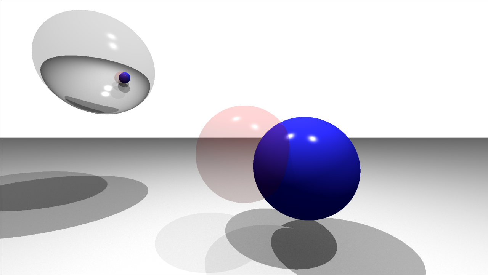

# Projets Epitech

Une sélection de mes projets les plus représentatifs réalisés à Epitech Lille. Ce dépôt ne regroupe pas l’intégralité de mon parcours : chaque dossier est un projet autonome, avec ses propres consignes, dépendances et documentation.

## Aperçu

| Projet | Domaine | Technologies | Points clés |
| --- | --- | --- | --- |
| [42sh](42sh/) | Système | C, Unix | Shell inspiré de `tcsh` : pipes, redirections, variables, historique, alias, globbing et auto-complétion. |
| [Corewar](Corewar/) | Système / algorithmie | C | Machine virtuelle capable d’exécuter des champions Corewar et d’interpréter leurs instructions. |
| [MyTeams](MyTeams/) | Réseau | C++17, sockets, `poll` | Réimplémentation client/serveur d’un outil de communication collaboratif inspiré de Microsoft Teams. |
| [Raytracer](Raytracer/) | Programmation orientée objet | C++20, libconfig++ | Moteur de rendu modulaire avec plugins, multithreading, matériaux, lumières et primitives avancées. |
| [Zappy](Zappy/) | Réseau / IA | C++, Python, SFML | Jeu réseau multijoueur : serveur, client graphique et intelligence artificielle. |

## Projets en détail

### 42sh — Shell Unix

Un interpréteur de commandes interactif basé sur les comportements de `tcsh`. Le projet couvre notamment l’exécution de commandes, les pipes, les redirections, la gestion de l’environnement, les alias, l’historique et l’édition de ligne avec auto-complétion.

```bash
cd 42sh
make
./42sh
```

→ [Documentation du projet](42sh/README.md)

### Corewar — Machine virtuelle

Une implémentation en C de la machine virtuelle Corewar. Elle charge des champions compilés et exécute le jeu d’instructions de l’arène, en gérant les registres, la mémoire et le cycle de vie des processus.

```bash
cd Corewar
make
./corewar champs/abel.cor champs/bill.cor
```

### MyTeams — Application client/serveur

Un système de messagerie collaboratif asynchrone reposant sur des sockets TCP et `poll`. Il propose la gestion des utilisateurs, messages privés, équipes, canaux, fils de discussion et réponses, au travers d’un protocole applicatif défini.

```bash
cd MyTeams
make
./myteams_server 4242
./myteams_cli 127.0.0.1 4242
```

→ [Documentation et protocole](MyTeams/README.md)

### Raytracer — Rendu 3D modulaire

Un raytracer C++20 qui lit des scènes de configuration et produit des images au format PPM. Son architecture par interfaces et bibliothèques dynamiques permet d’étendre indépendamment les primitives, matériaux, lumières et transformations. Le rendu s’appuie sur un découpage en tuiles et un pool de threads.

```bash
cd Raytracer
make
./raytracer scenes/test.cfg > output.ppm
```



→ [Documentation technique](Raytracer/README.md)

### Zappy — Jeu réseau, GUI et IA

Projet de fin de deuxième année composé de trois programmes : un serveur de jeu, une interface graphique SFML et une IA Python. Les équipes évoluent dans un monde torique, collectent des ressources et coopèrent pour réaliser des élévations de niveau.

```bash
cd Zappy
make
./zappy_server -p 4242 -x 10 -y 10 -n team1 team2 -c 2 -f 100
```

→ [Documentation du projet](Zappy/README.md)

## Organisation

Les projets se compilent depuis leur dossier respectif. Les cibles `make`, `make clean`, `make fclean` et `make re` sont disponibles selon le projet. Consultez le README de chaque dossier pour les prérequis et les options d’exécution.

## Auteur

Clément Dujardin-Duribreux — [GitHub](https://github.com/Clement-DujardinDuribreux)
