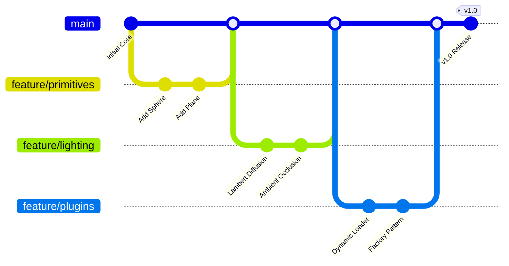

# Raytracer 🌟


A high-performance, modular Raytracer implemented in C++20. This project was developed as part of the Epitech OOP-400 course, focusing on clean architecture, design patterns (Factory, Abstract Factory), and a flexible plugin-based system.

---

## 📖 Table of Contents
- [Overview](#overview)
- [Features](#features)
- [Installation](#installation)
- [Usage](#usage)
- [Plugin System](#plugin-system)
- [Gallery](#gallery)
- [Documentation](#documentation)
- [Authors](#authors)

---

## 🔍 Overview

The goal of this project is to create a 3D renderer using the **Ray Tracing** technique. Our implementation emphasizes modularity and extensibility, allowing for the easy addition of new primitives, materials, and lights via a dynamic plugin system.

The raytracer parses scene configuration files and produces high-quality images in `.ppm` format.

---

## ✨ Features

### 🧊 Primitives
Our raytracer supports a wide range of geometric shapes, including complex mathematical surfaces:
- **Standard:** `Sphere`, `Plane`, `Box`, `Cylinder`, `Cone`, `Triangle`, `Torus`.
- **Complex:** `Mobius Strip`, `Tetrahedron`, `Pyramid`.
- **Fractals:** `Sierpinski Fractal`.
- **Custom Models:** Support for `.obj` file loading.

### 💡 Lighting
Realistic lighting effects achieved through:
- `Ambient Light`: Global illumination.
- `Point Light`: Positional light sources.
- `Directional Light`: Parallel light rays (like the sun).
- `Spot Light`: Conical light sources with direction and angle.
- `Color Light`: Lights with specific RGB values for atmospheric effects.

### 🎨 Materials
- `Flat Color`: Solid color rendering.
- `Mirror Material`: Perfect reflections.
- `Transparency Material`: Refraction and see-through effects.
- Support for `Shininess` and advanced material properties.

### ⚡ Optimization
- **Multithreading:** Utilizes a thread pool and tile-based rendering to maximize CPU usage.
- **Dynamic Loading:** Components are loaded as `.so` plugins at runtime.

---

## 🚀 Installation

### Prerequisites
- A C++20 compatible compiler (e.g., `g++` or `clang`).
- `libconfig++` library.
- `make` utility.

On Debian/Ubuntu:
```bash
sudo apt-get install libconfig++-dev
```

### Compilation
Build the main executable and all plugins:
```bash
make
```
*Note: This will create the `raytracer` binary and a `plugins/` directory containing `.so` files.*

---

## 🎮 Usage

You can run the raytracer by passing a scene configuration file as an argument. The output is written to standard output in PPM format.

```bash
./raytracer scenes/test.cfg > output.ppm
```

Alternatively, use the provided helper script:
```bash
chmod +x create_ppm.sh
./create_ppm.sh scenes/test.cfg
```

### Scene Configuration

Scenes are defined using `.cfg` files. You can configure the camera, primitives, materials, and lights. Example:
```libconfig
camera: {
    resolution = { width = 1920; height = 1080; };
    position = { x = 0; y = 20; z = -100; };
    fieldOfView = 72.0;
};
# ... see scenes/ directory for more examples
```

---

## 🔌 Plugin System

Our architecture allows for seamless extension. To add a new primitive or material:
1. Implement the corresponding interface (`IPrimitive`, `IMaterial`, etc.).
2. Compile it as a shared library (`.so`).
3. Place it in the `plugins/` folder.
4. Reference it in your `.cfg` file.

---

## 🖼️ Gallery

| Scene 1 | Scene 2 |
| :---: | :---: |
|  |  |

| Scene 3 | Scene 4 |
| :---: | :---: |
|  |   |

---

## 📚 Documentation

For a deep dive into how the project works and how to extend it, check out our detailed guides:

- [**Architecture Overview**](docs/ARCHITECTURE.md)
- [**Internal Works: Rendering Process**](docs/INTERNAL_WORKS.md)
- [**Mathematical Foundation**](docs/MATH.md)
- [**Plugin Development Guide**](docs/PLUGINS.md)
- [**Primitive Creation Guide**](docs/PRIMITIVES.md)
- [**Material Creation Guide**](docs/MATERIALS.md)
- [**Light Creation Guide**](docs/LIGHTS.md)
- [**Transform Creation Guide**](docs/TRANSFORMS.md)
- [**OBJ Model Loading**](docs/OBJ.md)
- [**Scene Configuration Guide**](docs/SCENES.md)
- [**Scene Gallery & Test Cases**](docs/SCENE_GALLERY.md)

Detailed API documentation can also be generated using Doxygen:

```bash
make docs
```
Open `docs/doxygen/html/index.html` in your browser to view the technical documentation.

---

## 🛠️ Development Workflow

We follow a modular development process. Each major feature (primitive, material) is developed in its own branch before being merged into the main core.



---

## 👥 Authors

- **Gabriel Decloquement**
- **Florent Dujardin--Duribreux**
- **Clement Dujardin--Duribreux**
- **Pierre Leclercq**

---
*Developed with ❤️ as part of the Epitech OOP Raytracer Project.*
