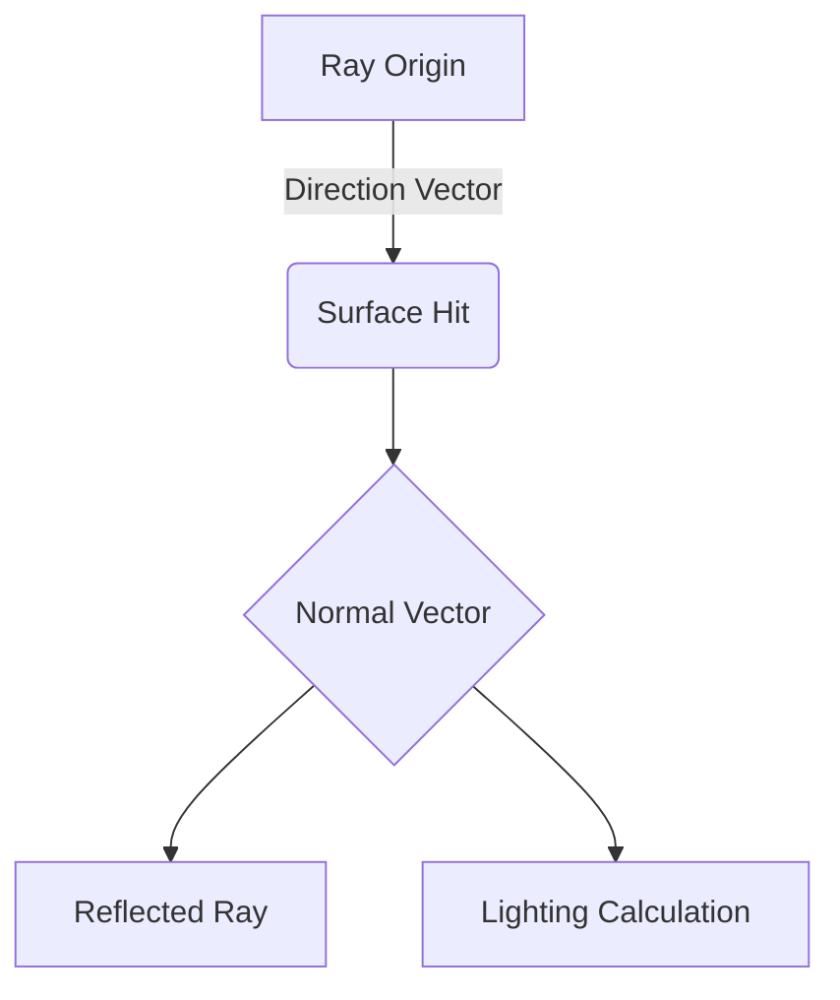

# Mathematical Foundation 📐

The Raytracer relies on 3D geometry and vector calculus. This guide explains the coordinate system and the core mathematical classes.

## 🌌 The Coordinate System

Our engine uses a **Right-Handed System**:

```text
       +Y (Up)
        |
        |
        |_______ +X (Right)
       /
      /
    +Z (Forward/Into screen)
```

- **X-axis**: Horizontal (Left to Right).
- **Y-axis**: Vertical (Bottom to Top).
- **Z-axis**: Depth (Near to Far).

---

## 📍 Point3D vs Vector3D

While both store `x, y, z` coordinates, they represent different concepts:

### `Math::Point3D`
Represents a **position** in space.
- **Key Operations**:
    - `Point + Vector = Point` (Translating a point).
    - `Point - Vector = Point`.
    - `Point == Point`.

### `Math::Vector3D`
Represents a **direction and magnitude** (length).
- **Key Operations**:
    - `Vector + Vector = Vector`.
    - `Vector * Scalar = Vector` (Scaling).
    - `Vector.dot(Vector)`: Dot product (returns `double`).
    - `Vector.cross(Vector)`: Cross product (returns `Vector3D`).
    - `Vector.length()`: Magnitude of the vector.
    - `Vector.getNormal()`: Normalization (returns a vector of length 1).

---

## ⚡ Core Algorithms

### 1. Ray Representation
A ray is defined by its origin point ($O$) and its direction vector ($D$):
$$P(t) = O + t \cdot D$$
Where $t > 0$ is the distance along the ray.

### 2. Dot Product ($A \cdot B$)
Used to find the angle between two vectors (e.g., for Lambertian lighting).
- If $A \cdot B > 0$: The angle is less than 90°.
- If $A \cdot B = 0$: The vectors are perpendicular.
- If $A \cdot B < 0$: The angle is greater than 90°.

### 3. Normal Calculation
The "Normal" is a vector perpendicular to a surface. 
- For a **Sphere**: $Normal = (HitPoint - Center).normalize()$.
- For a **Triangle**: Calculated using the cross product of two edges.

### 4. Cross Product ($A \times B$)
Returns a vector perpendicular to both $A$ and $B$. Essential for finding surface normals and defining the camera's orientation (Up, Right, Forward).

---

## 🧪 Diagram: Ray-Sphere Intersection


