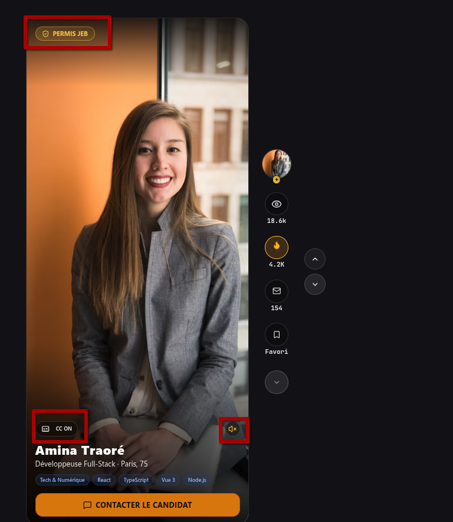

# MINISTÈRE DU JOB ET BONHEUR

### Direction des Affaires Juridiques

### Plateforme Numérique « JibJob »

---

# DÉCLARATION D'ACCESSIBILITÉ NUMÉRIQUE

**Référentiel appliqué :** RGAA version 4.1 (Niveau Double-A / WCAG 2.1 AA)
**Destinataire :** Florine Pontaillac, Conseillère juridique au Cabinet du Ministre
**Date d'établissement :** 2 septembre 2026 — Version 1.1
**Autorité responsable :** Ministère du Job et Bonheur — Direction du Numérique et de l'Insertion
**Modalités de signalement :** Formulaire de contact et d'assistance du portail ou espace personnel

---

### 1. ENGAGEMENT DE CONFORMITÉ

Le Ministère du Job et Bonheur s'engage à rendre sa plateforme « JibJob » accessible conformément à l'article 47 de la loi n° 2005-102 du 11 février 2005 pour l'égalité des droits et des chances.

La présente déclaration d'accessibilité s'applique au service numérique JibJob (programme national ProfilsActifs).

---

### 2. ÉTAT DE CONFORMITÉ

La plateforme JibJob est **totalement conforme** avec le référentiel général d'amélioration de l'accessibilité (RGAA version 4.1), niveau Double-A (AA).

L'audit technique a été conduit sur l'échantillon des trois écrans opérationnels du service :

#### Écran 1 — Parcours Inscription & Authentification

* **Étiquetage sémantique :** Association stricte de chaque champ à son étiquette descriptive via `<label for="...">`.
* **Traitement des erreurs de saisie :** Vocalisation immédiate des messages d'invalidation via les attributs `aria-invalid="true"` et le rôle `role="alert"`.
* **Navigation :** Prise en charge intégrale de la saisie et de la validation sans souris (clavier seul).

#### Écran 2 — Fiche Profil Public Candidat

* **Sous-titrage universel :** Intégration impérative d'une piste textuelle synchronisée `.vtt` pour toute séquence vidéo mise en ligne. Le lecteur intègre un bouton de commande CC et réagit aux raccourcis clavier (<kbd>Espace</kbd> pour lecture/pause, <kbd>M</kbd> pour mise en sourdine).
* **Interdiction stricte de l'autoplay et gestion multi-flux :** Aucun flux audiovisuel ne se déclenche automatiquement sans action volontaire de l'usager. Le système bloque techniquement toute lecture simultanée multi-flux en suspendant automatiquement tout flux préexistant.
* **Hiérarchie typographique :** Respect d'un ordre strict et sans rupture des niveaux de titres (`h1` à `h3`).
* **Alternatives graphiques :** Attribut `alt` renseigné pour toute image porteuse d'information et neutralisé pour les éléments décoratifs.

#### Écran 3 — Catalogue de Recherche Recruteur

* **Pilotage clavier des filtres :** Accès, activation et réinitialisation des critères de recherche par touches de tabulation et touches directionnelles.
* **Gestion du focus dans les modales :** Confinement du focus (*focus trap*) dans la fenêtre de contact direct et fermeture instantanée par appui sur la touche <kbd>Échap</kbd>.
* **Restitution dynamique :** Mise à jour asynchrone des résultats sans rupture de lecture ni perte de positionnement pour les lecteurs d'écran.

---

### 3. MESURES RÉELLES DES RATIOS DE CONTRASTE

Les relevés colorimétriques ont été réalisés selon l'algorithme WCAG 2.1 sur les environnements de production :

| Composant testé                           | Valeurs colorimétriques            | Ratio mesuré      | Norme RGAA AA             |
| ------------------------------------------ | ----------------------------------- | ------------------ | ------------------------- |
| **Titres & Textes institutionnels**  | Texte`#1B3A6B` / Fond `#FFFFFF` | **11,2 : 1** | ≥ 4,5 : 1 (Conforme AAA) |
| **Bouton d'Action Primaire**         | Texte`#FFFFFF` / Fond `#000091` | **14,1 : 1** | ≥ 4,5 : 1 (Conforme AAA) |
| **Bouton d'Action Secondaire (CTA)** | Texte`#09090F` / Fond `#D97706` | **7,4 : 1**  | ≥ 4,5 : 1 (Conforme AAA) |
| **Texte courant (Thème Sombre)**    | Texte`#FFFFFF` / Fond `#09090F` | **19,8 : 1** | ≥ 4,5 : 1 (Conforme AAA) |

*Indicateurs de focus clavier :* Le contour visuel actif (2 pixels, couleur `#000091` ou `#D97706`) présente un ratio de contraste supérieur à **3,5 : 1** par rapport aux surfaces adjacentes (exigence minimale fixée à 3,0 : 1).

---

### 4. TECHNOLOGIES UTILISÉES ET COMPATIBILITÉ MULTI-SUPPORTS

1. **Technologies socles :** HTML5, CSS3 (moteur Tailwind compatible DSFR), TypeScript, Vue.js 3.
2. **Autonomie d'affichage :** L'interface ne produit aucune perte de contenu ni double défilement lors des tests sur trois formats étalons : mobile (largeur 390px), tablette (largeur 768px) et grand écran (largeur 1280px et supérieure).
3. **Polices de caractères souveraines :** Les polices Marianne et Spectral sont embarquées localement au format Woff2 afin de prévenir tout blocage lié à des serveurs tiers.

---

### 5. DISPOSITIF DE SIGNALEMENT ET VOIES DE RECOURS

Conformément aux exigences légales de l'arrêté ministériel :

* **Signalement direct :** Utilisez le formulaire de contact et d'assistance disponible sur le portail ou depuis votre espace personnel. Une réponse vous est apportée sous cinq jours ouvrés.
* **Recours légal :** Si vous constatez un défaut d'accessibilité vous empêchant d'accéder à un contenu ou une fonctionnalité du site, que vous nous le signalez et que vous ne parvenez pas à obtenir une réponse de notre part, vous êtes en droit de faire parvenir vos doléances ou une demande de saisine au Défenseur des droits :
  * Par téléprocédure sur le portail officiel : [defenseurdesdroits.fr](https://www.defenseurdesdroits.fr) ;
  * Par courrier gratuit sans affranchissement à : *Défenseur des droits, Libre réponse 71120, 75342 Paris CEDEX 07*.
