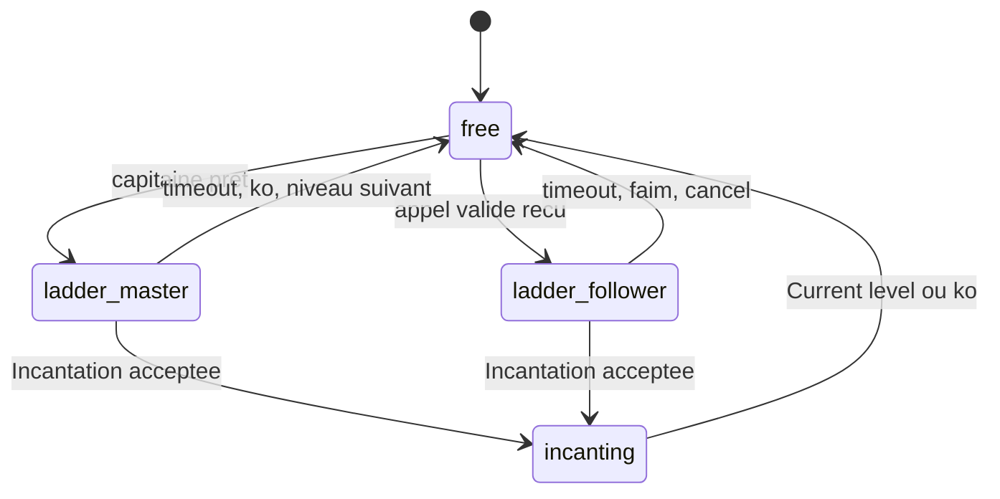

# Machine à états

L'IA n'utilise pas une machine à états très abstraite avec beaucoup de rôles concurrents. Le code garde plutôt un mode principal dans `Agent.mode`, complété par des priorités globales comme la nourriture critique ou l'incantation en cours.

Les modes utilisés sont :

| Mode | Rôle |
|---|---|
| `free` | Etat normal. Le joueur collecte, mange, fork ou attend selon son rôle. |
| `ladder_master` | Le capitaine a ouvert une session d'incantation et rassemble les supports. |
| `ladder_follower` | Un support suit les Broadcasts du capitaine pour rejoindre la case d'incantation. |
| `incanting` | Ce n'est pas un mode texte, mais un booléen qui bloque les décisions pendant une incantation acceptée. |

## Priorité globale

La survie passe avant tout. A chaque tour, l'agent lit les événements serveur, met à jour son état, puis décide :

1. si le joueur est mort, la boucle s'arrête ;
2. si une incantation est en cours, il attend les réponses serveur ;
3. si la nourriture est critique, il quitte la session éventuelle et cherche à manger ;
4. si le mode est `ladder_master`, il exécute la logique de rassemblement et d'incantation ;
5. si le mode est `ladder_follower`, il suit le capitaine ;
6. sinon, il agit en mode libre selon qu'il est capitaine ou support.

## Mode libre

En mode libre, le comportement dépend de l'élection du capitaine.

Le capitaine :

- vérifie la population et crée des slots avec `Fork` si nécessaire ;
- garde une réserve de nourriture élevée ;
- collecte les pierres manquantes pour compléter la banque ;
- attend que l'équipe soit prête ;
- lance une session d'incantation.

Les supports :

- collectent principalement de la nourriture ;
- broadcastent régulièrement leur inventaire ;
- rejoignent le capitaine seulement quand une session d'incantation valide est annoncée.

## Session d'incantation

Une session est identifiée par un `session_id` du type `BANK-<level>-<agent_id>-<tick>`. Elle évite de mélanger plusieurs rassemblements.

Le capitaine en mode `ladder_master` :

- broadcast `INCANTATION` toutes les quelques itérations ;
- vérifie que les joueurs sont sur sa case ;
- attend les `READY` des supports ;
- prépare exactement les pierres du niveau courant sur la tuile ;
- lance `Incantation` si la case est prête.

Un support en mode `ladder_follower` :

- met à jour la direction du capitaine à chaque Broadcast reçu ;
- se déplace vers la source du son ;
- envoie `READY` quand la direction vaut `0`, donc quand il est sur la même case ;
- abandonne si le capitaine n'est plus entendu, si la session expire ou si la nourriture devient trop basse.

## Transitions principales

## Pourquoi cette forme

Les anciennes versions donnaient plus de responsabilités à chaque agent. En pratique, cela créait beaucoup de cas limites : plusieurs leaders, trop de Broadcasts, agents bloqués à des niveaux différents, et pierres dispersées. Le système actuel réduit ces problèmes en laissant le capitaine prendre les décisions coûteuses, pendant que les supports restent simples et disponibles.
