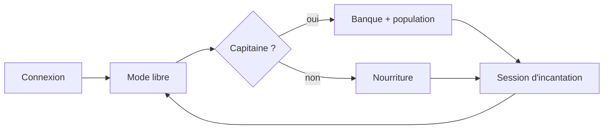

# Zappy AI - Documentation

Cette documentation décrit l'IA Python utilisée pour piloter les joueurs Zappy. Elle se concentre sur le comportement réel du code actuel : une équipe organisée autour d'un capitaine, une banque de ressources centralisée, et des supports qui survivent en attendant les incantations.

## Structure

| Fichier | Contenu |
|---|---|
| [`01_state_machine.md`](./01_state_machine.md) | Modes de l'agent et priorités de décision |
| [`02_game_logic.md`](./02_game_logic.md) | Boucle principale, survie, collecte, population |
| [`03_communication.md`](./03_communication.md) | Protocole serveur et Broadcast interne |
| [`04_navigation.md`](./04_navigation.md) | Parsing de `Look` et déplacements |
| [`05_elevation.md`](./05_elevation.md) | Incantations et système de banque |
| [`06_algorithmes_testes.md`](./06_algorithmes_testes.md) | Stratégies testées avant l'algorithme final |

## Objectif de l'IA

Chaque exécution du programme contrôle un seul joueur. Le but est d'amener au moins 6 joueurs de l'équipe au niveau 8 avant les autres équipes. Pour y arriver, l'IA doit :

1. survivre en maintenant une réserve de nourriture suffisante ;
2. récupérer les pierres nécessaires aux élévations ;
3. créer des slots disponibles avec `Fork`, puis connecter les nouveaux clients manuellement ;
4. rassembler les joueurs au bon moment pour les incantations ;
5. enchaîner les niveaux avec le moins de désynchronisation possible.

## Stratégie actuelle

La stratégie finale repose sur un modèle de banque :

- un capitaine est élu de manière déterministe ;
- le capitaine collecte toutes les pierres nécessaires pour monter jusqu'au niveau 8 ;
- les autres joueurs priorisent la nourriture et restent disponibles ;
- quand la banque est complète et que 6 joueurs sont prêts, le capitaine appelle les supports ;
- les élévations sont enchaînées au même endroit, avec le capitaine qui pose les pierres exactes pour chaque niveau.

Ce choix limite le nombre de décisions distribuées. Les versions précédentes essayaient de faire coopérer tout le monde en permanence, mais les Broadcasts et les retards entre agents créaient trop de blocages.

## Comportements selon l'équipe

Le comportement dépend surtout du nombre de joueurs connus dans l'équipe :

- seul, l'agent agit comme capitaine. Il cherche de la nourriture, collecte les pierres utiles pour préparer la banque, utilise `Fork` pour ouvrir des slots, puis attend que d'autres IA soient connectées manuellement ;
- à deux ou plus, les agents restent en préparation. Le capitaine continue la banque et la gestion des slots, tandis que les supports survivent, broadcastent leur inventaire et attendent les appels ;
- à six joueurs, l'équipe passe sur l'algorithme classique de montée. Le capitaine rassemble les supports, pose les pierres exactes et lance les incantations pour monter ensemble jusqu'au niveau 8.

L'objectif est d'éviter des montées isolées. Les joueurs attendent d'être assez nombreux pour enchaîner les niveaux en groupe, avec une banque centralisée.

## Contraintes importantes

| Contrainte | Impact sur l'IA |
|---|---|
| 1 processus = 1 joueur | Pas de mémoire partagée entre les agents. |
| Broadcast public | Tous les messages peuvent être reçus par les ennemis. |
| Buffer de commandes | Le client ne doit pas saturer le serveur avec trop de commandes en attente. |
| Monde torique | La carte boucle sur elle-même, donc les sons suivent le chemin le plus court. |
| Incantation longue | Une incantation coûte 300 unités de temps et fige les joueurs impliqués. |

## Cycle général

Ce schéma résume seulement le flux principal. Les détails de décision sont expliqués dans les fichiers suivants.
